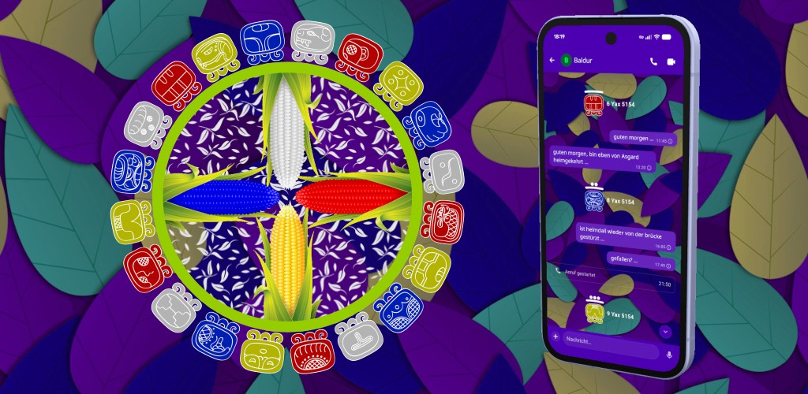

# Maya Chat Android

Matrix client who brings the Nahuales into the world of Matrix, based on [Element X Android](https://element-hq.github.io/element-x-android).

<table>
  <tr>
    <td colspan="2" align="center">
      
    </td>
  </tr>
  <tr>
    <td align="right"></td>
    <td align="left"></td>
  </tr>
  <tr>
    <td align="right"></td>
    <td align="left"></td>
  </tr>
</table>